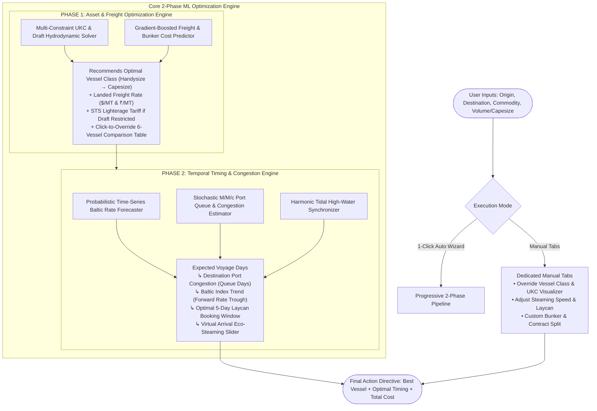

# Vedha Logistics — AI Maritime Freight Forecasting & Charter Optimization Platform

[](https://vitejs.dev/)
[](https://reactjs.org/)
[](https://www.typescriptlang.org/)
[](https://tailwindcss.com/)
[](LICENSE)

> **An enterprise-grade AI maritime freight intelligence and charter optimization platform. Built to transition bulk raw material procurement (Coking Coal, Thermal Coal, Iron Ore, Limestone, and Bauxite) across India's East Coast ports from volatile daily spot fixtures into high-yield, risk-managed multi-voyage contracts (Contracts of Affreightment - COAs).**

---

## 📌 Problem Background & Strategic Objectives

Procuring bulk raw materials for India's East Coast industrial corridor (Odisha, Andhra Pradesh, West Bengal) is traditionally exposed to reactive spot market chartering. This leads to:

1. **Unhedged Freight Volatility**: Missing cyclical rate troughs across the Baltic Dry Index (BDI, BCI, BPI, BSI).
2. **Suboptimal Vessel Nomination**: Mismatches between vessel intake (Handysize, Supramax, Ultramax, Panamax, Kamsarmax, Capesize) and port infrastructure limits.
3. **Severe Riverine & Tidal Bottlenecks**: Inadequate pre-planning for draft restrictions at riverine ports like **Haldia** (7.5m - 8.5m draft) requiring Ship-to-Ship (STS) lighterage at **Sagar-Sandheads** or **Dhamra**.
4. **Vessel Idle Time & Deadheading**: Lack of triangulation and backhaul matching leading to costly ballast voyages.

**Vedha Logistics** solves these challenges through:
- **Progressive 2-Phase Chartering Wizard**: 1-Click Automated AI solver on Home with seamless manual overrides in dedicated tabs.
- **Optimal Market Entry Timing**: 180-day probabilistic Baltic rate trajectories with actionable buy/hold directives.
- **Vessel Type & Port Draft Optimization**: Multi-constraint Under-Keel Clearance (UKC) solver with cross-sectional water column visualization.
- **MILP Portfolio Allocation**: Mathematical distribution across Spot, Multi-Voyage COA (3-6M), and Period Time Charter (6-12M) with VaR95 risk reduction.
- **Idle Scenario Management & Virtual Arrival**: Non-linear cubic propeller law simulator ($F = F_{\text{design}} \cdot (V/V_{\text{design}})^3$) cutting bunker fuel burn, avoiding demurrage, and abating Scope 1 $\text{CO}_2\text{e}$.
- **Risk Mitigation**: Live East Coast queue radar and macroeconomic volatility shock simulations.

---

## ⚡ Flagship Feature: Progressive 2-Phase Chartering Wizard

The platform features an automated, progressive **2-Phase Decision Pipeline** accessible directly from the Home page:



### Screen Flow:
1. **Screen 1 (Route & Cargo Input)**: Select Origin, Discharge Port, Commodity, and Parcel Volume $\rightarrow$ Click **"Run Intelligent Voyage Analysis"**.
2. **Screen 2 (Phase 1: Asset & Freight Optimization)**:
   - **Hero AI Card**: Winning vessel class, landed freight $/MT (and ₹/MT), total spend, UKC draft safety margins, and STS lightering requirements.
   - **Interactive 6-Vessel Comparison**: Handysize, Supramax, Ultramax, Panamax, Kamsarmax, Capesize with 1-click override selection.
3. **Screen 3 (Phase 2: Temporal & Congestion Optimization)**:
   - **Expected Voyage Days** (Sea transit + port handling).
   - **Destination Port Congestion (Queue Days)** placed directly below expected days.
   - **Baltic Index Signal** (forward rate trough projection).
   - **Tidal High-Water Window & Recommended Laycan Window**.
   - **Virtual Arrival Speed Slider (10.5–14.5 kts)** with live bunker fuel and demurrage savings.
   - **Export Charter Directive** modal with 1-click clipboard sharing.

---

## 📡 Live Telemetry & Data Updating Mechanisms

| Data Stream | Primary Sources | Ingestion Frequency | Mathematical & ML Update Engine |
| :--- | :--- | :---: | :--- |
| **Baltic Indices (BDI, BCI, BPI, BSI)** | The Baltic Exchange (London) API, Clarksons SIN, Freight Derivatives Wire | Daily at 13:00 UTC | **SARIMAX / ARDL Time-Series Forecaster**: Ingests new daily fixtures, updates lag regressors, and generates 180-day forward curves with Monte Carlo 95% confidence bands ($p_{10}, p_{50}, p_{90}$). |
| **Port Congestion & Queue Days** | AIS Satellite Feeds (Kpler / MarineTraffic / Spire), Indian Major Ports Authority (IPA / Sagarmala) | Real-time & Daily 24h reports | **Stochastic $M/M/c$ Queueing Model**: $\text{Queue Days} = \frac{\text{Anchorage Vessels} \times \text{Avg DWT}}{\text{Berth Handling TPD}}$. Feeds Phase 2 and Virtual Arrival. |
| **Bunker Fuel Prices** | Singapore VLSFO Bunker Wire | Daily | Updates fuel burn models ($F = F_0 \cdot (V/V_0)^3$) and landed freight $/MT. |
| **Tidal & Estuarine Limits** | Hooghly River / Kolkata Port Trust Tide Tables | Semi-Diurnal / Monthly | Harmonic Spring Tide matching for maximum draft high-water windows. |

---

## 🚢 Monitored Corridors & Port Infrastructure

### 🇮🇳 East Coast India Discharge Ports
| Port Name | UN/LOCODE | Max Permissible Draft | Max LOA | Max Beam | Discharge Rate (TPD) | Permitted Vessels | Berthing & Lighterage Constraints |
| :--- | :---: | :---: | :---: | :---: | :---: | :---: | :--- |
| **Paradip Port** | `INPRT` | **16.0 m** | 260 m | 43.0 m | 32,000 MT/d | Cape / Panamax / Supra | Deep draft mechanized coal terminal (MCH). Direct Panamax/Kamsarmax intake. |
| **Visakhapatnam (Vizag)** | `INVTZ` | **18.1 m** | 285 m | 45.0 m | 35,000 MT/d | Capesize / Panamax | Outer harbour supports 200k DWT Capesize; Inner harbour restricted to 14.5m draft. |
| **Gangavaram Port** | `INGGV` | **18.5 m** | 300 m | 50.0 m | 38,000 MT/d | Super Capesize | All-weather deepwater terminal with fastest bulk discharge turnaround. |
| **Gopalpur Port** | `INGPL` | **14.0 m** | 225 m | 32.5 m | 18,000 MT/d | Panamax / Supramax | Geared grab discharge. Suited for Supramax and short-loaded Panamax. |
| **Dhamra Port** | `INDHR` | **18.0 m** | 300 m | 48.0 m | 42,000 MT/d | Capesize / Baby Cape | Deep draft automated conveyor discharge; ideal alternative to Haldia/Paradip. |
| **Sagar - Sandheads** | `INSAG` | **9.0 m (River)** | 310 m | 50.0 m | 16,000 MT/d | Capesize (Lightering) | Deepwater offshore anchorage for Ship-to-Ship (STS) lighterage ($4.20/MT). |
| **Haldia Dock Complex** | `INHAL` | **8.5 m (Tidal)** | 230 m | 32.2 m | 15,000 MT/d | Handysize / Supramax | Strict Hooghly river sandbar draft limits; necessitates pre-lightering or parceling. |

### 🌐 Key Global Loading Origins
- **Australia**: Hay Point / Dalrymple Bay (DBCT), Newcastle (PWCS/NCIG), Gladstone (RG Tanna), Abbot Point.
- **United States**: Norfolk / Hampton Roads (Lamberts Point & Pier IX), New Orleans (Mississippi River IMT), Baltimore (CNX Marine).
- **Indonesia**: Taboneo Anchorage (South Kalimantan), Muara Berau / Samarinda, Tanjung Bara (KPC Deepwater).
- **Mozambique**: Maputo / Matola Coal Terminal (TCM), Nacala Deepwater Port.
- **Russia**: Taman Bulk Terminal (Black Sea), Ust-Luga (Baltic Sea), Vostochny (Far East).

---

## ⚡ Key Platform Modules

### 1. 🏠 Landing Homepage with 2-Phase Wizard (`LandingHomePage.tsx` & `TwoPhaseWizard.tsx`)
- High-tech **World Maritime Sea Routes Vector Map Background**.
- **Automated 2-Phase Chartering Wizard**: Sequential asset optimization $\rightarrow$ temporal congestion synchronization.
- Real-time operational metric counters (14.8M MT volume modeled, 13.5% average landed savings, 85,000+ MT $\text{CO}_2$ abated).

### 2. 📈 Optimal Market Entry Timing & AI Freight Forecasting (`FreightForecastDashboard.tsx`)
- **Plain-English AI Action Cards**: Direct recommendations (*"LOCK 6-MONTH COA NOW"*, *"WAIT / SPOT BUFFER"*).
- **Probabilistic Time-Series Curve**: 12-month historical actuals + 180-day forward forecasts with 95% confidence bands across **BCI (Capesize)**, **BPI (Panamax)**, **BSI (Supramax)**, and **BDI (Composite)**.

### 3. ⚓ Vessel Selection & Port Infrastructure Solver (`VesselOptimizerTool.tsx`)
- **Three-Tier Feasibility Engine**: Strict evaluation generating `PASSED`, `RESTRICTED - LIGHTERING REQ`, or `REJECTED`.
- **Interactive Under-Keel Clearance (UKC) Water-Column Visualizer**: Cross-sectional hull diagram showing submerged vessel draft against permissible berth chart datum and safe UKC margins.
- **Automated STS Lightering Engine**: Computes mandatory lightering volumes and STS tariffs ($4.20/MT at Sandheads for Haldia).

### 4. 📄 Contract & Laycan Strategy Optimizer (`COAContractPlanner.tsx`)
- **MILP Mathematical Portfolio Solver**: Allocates cargo volume across Spot, Multi-Voyage COA (3-6M), and Period Time Charter (6-12M) based on an interactive risk-tolerance slider.
- **Landed Cost Waterfall**: Side-by-side comparison showing landed rate/MT, total spend ($/₹), and 95% Value-at-Risk (VaR95) tail-risk reduction.

### 5. 🌿 Virtual Arrival & Green Steaming Simulator (`VirtualArrivalSimulator.tsx`)
- **Non-Linear Cubic Steaming Physics**: Simulates fuel burn reduction:
  $$\text{Sea Fuel Burn (MT/day)} = \text{Design Sea Fuel} \times \left(\frac{V_{\text{opt}}}{V_{\text{design}}}\right)^3$$
- **High-Impact ROI Metrics**: Net Financial Savings ($ and ₹), VLSFO Bunker Fuel Saved (MT), Demurrage Avoidance ($ and ₹), Scope 1 $\text{CO}_2\text{e}$ Abatement (MT), and IMO CII grade upgrades.

### 6. 🚨 Port Congestion Radar & Risk Monitor (`PortCongestionMonitor.tsx`)
- Live queue days and turnaround benchmarks across all 7 Indian East Coast ports.
- **Interactive Macro Shock Simulator**: One-click stress testing for *China Steel Surge*, *Bay of Bengal Monsoon Disruption*, *Geopolitical Bunker Spike (+25%)*, and *Chokepoint Rerouting*.

---

## 💻 Tech Stack & Architecture

- **Frontend Core**: React 19, TypeScript, HTML5
- **Styling**: Tailwind CSS v4, Custom Maritime Design System, Glassmorphic overlays
- **Icons**: Lucide React
- **Build Tool**: Vite 6 (Fast HMR & Production Bundler)
- **Math & Solvers**: Custom TypeScript engines for MILP portfolio allocation, cubic hydrodynamics, and Under-Keel Clearance physics.

---

## 🚀 Getting Started

### Installation & Run

```bash
# 1. Clone the repository
git clone https://github.com/24f2002727/Vedha-Logistics.git
cd Vedha-Logistics

# 2. Install dependencies
npm install

# 3. Run the development server
npm run dev
```

### Automated Testing & Production Build

```bash
# Run the automated verification test suite
npx tsx src/test-suite.ts

# Build for production
npm run build
```

---

## 🧪 Automated Verification Suite

```bash
🚢 [VEDHA LOGISTICS TEST SUITE] Starting Automated Verification Engine...

--- TEST 1: East Coast India Draft & Lightering Validation ---
Haldia + Capesize: Status = RESTRICTED (Expected: RESTRICTED)
Lightering Required: true, Volume: 84,066 MT, Tariff: $353,077 ($4.2/MT)
Gangavaram + Capesize: Status = PASSED (Expected: PASSED, UKC: +0.3m)

--- TEST 2: MILP Mathematical Portfolio Optimization ---
Total Voyage Liftings: 9
Contract Portfolio Breakdown: Spot: 5% (30,000 MT) | COA: 59.4% (356,250 MT) | TimeCharter: 35.6% (213,750 MT)
Landed Freight: Pure Spot = $18.5/MT | Recommended Hybrid = $16.06/MT
Projected Net Savings: $1,464,186 (13.2%) | ₹12.67 Cr | VaR95 Reduction = 67%

--- TEST 3: Virtual Arrival & Green Steaming Physics ---
Fuel Saved: 269.7 MT VLSFO ($166,675)
Demurrage Avoidance: $112,000
Scope 1 GHG Abatement: 839.9 MT CO2e
Net Financial Benefit: $278,675 (₹2.41 Cr)
IMO CII Rating Upgrade: +38% (Grade D ➔ Grade A)

--- TEST 4: Currency Formatter & Conversion ---
USD Formatting: $2,450,000
INR Formatting: ₹21.19 Cr
INR Freight Rate: ₹1,600/MT

✅ [ALL 4 TESTS PASSED SUCCESSFULLY! Mathematical & physical models validated.]
```

---

## 📄 License

This project is licensed under the MIT License — see the [LICENSE](LICENSE) file for details.
