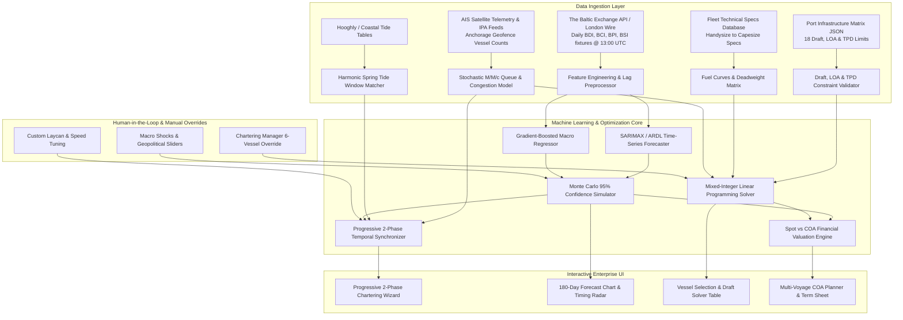

# Vedha Logistics — Machine Learning Models, Datasets & Ingestion Pipeline Guide

This guide documents all **Machine Learning models, mathematical optimization formulations, real-time data ingestion pipelines, and human-in-the-loop (HITL) workflows** powering the Vedha Logistics platform.

---

## 🏗️ End-to-End System Architecture Flowchart

---

## 📊 Inventory of All Datasets Used

All datasets are stored in `ml/datasets/` and `src/data/` for direct inspection and automated ingestion.

### 1. `ml/datasets/historical_freight_rates.csv`
Contains 10-year monthly econometric and maritime time series data:
- `date`: Month identifier (`YYYY-MM`).
- `bdi`: Baltic Dry Index (Composite dry bulk benchmark).
- `bci`: Baltic Capesize Index (~180,000 DWT vessels).
- `bpi`: Baltic Panamax Index (~75,000 DWT vessels).
- `bsi`: Baltic Supramax Index (~55,000 DWT geared vessels).
- `bhsi`: Baltic Handysize Index (~35,000 DWT vessels).
- `vlsfo_singapore_usd`: Very Low Sulfur Fuel Oil price ($/MT) in Singapore.
- `coking_coal_fob_aus_usd`: Australian Premium Hard Coking Coal FOB ($/MT).
- `thermal_coal_fob_indo_usd`: Indonesian 4200 GAR Thermal Coal FOB ($/MT).
- `iron_ore_cfr_china_usd`: 62% Fe Iron Ore Fines CFR Qingdao ($/MT).
- `paradip_congestion_days`: Average vessel waiting queue days at Paradip.
- `haldia_congestion_days`: Average vessel waiting queue days at Haldia dock.
- `fleet_growth_pct`: Global dry bulk fleet net tonnage annual growth rate (%).
- `dxy_index`: US Dollar Currency Index.
- `monsoon_active_india`: Binary flag (1 = Active SW Monsoon June-Sept, 0 = Dry Season).

### 2. `ml/datasets/port_infrastructure_matrix.json` & `src/data/portsData.ts`
Stores physical and operational limitations for Indian East Coast ports & global loading hubs:
- `max_draft_meters`: Absolute maximum permissible draft at chart datum.
- `max_loa_meters`: Maximum Length Overall allowed at discharge berths.
- `max_beam_meters`: Maximum vessel width for berthing cranes.
- `cargo_handling_tpd`: Average 24-hour discharge/loading throughput (Tons Per Day).
- `is_riverine`: Flag for riverine/estuarine draft bars (e.g. Haldia Hooghly channel).
- `requires_lighterage_capesize`: Whether Capesize vessels must perform Ship-to-Ship (STS) lightering at Sagar-Sandheads.
- `avgWaitingDays`: Real-time / historical average anchorage queue days.
- `congestionStatus`: Qualitative status indicator (`Low`, `Moderate`, `High`, `Severe`).

### 3. `src/data/vesselData.ts`
Fleet technical specifications:
- Deadweight intake (Handysize 35k, Supramax 55k, Ultramax 63.5k, Panamax 75k, Kamsarmax 82k, Capesize 180k MT).
- Speed curves (Laden 13.0–14.2 knots, Ballast 13.5–15.0 knots).
- Fuel consumption models at sea (18.5 to 48.0 MT/day) and in port (3.5 to 5.5 MT/day).
- Daily charter hire baseline benchmarks for Spot, 3-Month COA, and 12-Month COA.

---

## 🤖 Machine Learning & Optimization Models Explained

### Model 1: AutoRegressive Distributed Lag (ARDL) & SARIMAX Forecaster
Captures cyclical seasonality (monsoon lulls, Australian cyclone season, Q4 restocking surges):
$$\Phi_P(B^s)\phi_p(B)(1-B)^d(1-B^s)^D Y_t = \Theta_Q(B^s)\theta_q(B)\epsilon_t + \sum_{k=1}^{K} \beta_k X_{k,t}$$
- **Endogenous Target ($Y_t$)**: Baltic Indices (`bci`, `bpi`, `bsi`, `bdi`).
- **Exogenous Regressors ($X_{k,t}$)**: VLSFO Bunker prices, Coal/Ore spreads, Monsoon indicator, DXY, Port waiting queues.

### Model 2: Monte Carlo Probabilistic Confidence Simulator
Computes forward uncertainty bands widening over forecast horizon $h$:
$$\hat{Y}_{t+h} \pm z_{1 - \alpha/2} \cdot \sigma_{\text{RMSE}} \sqrt{h \cdot \gamma}$$
where $z_{0.975} = 1.96$ for the 95% confidence interval ($p_{10}, p_{50}, p_{90}$).

### Model 3: Stochastic $M/M/c$ Port Queue & Congestion Estimator
Predicts anchorage waiting days based on arrival rates ($\lambda$) and mechanized berth service rates ($\mu$):
$$L_q = \frac{(\lambda/\mu)^c \rho}{c! (1 - \rho)^2} P_0, \quad W_q = \frac{L_q}{\lambda}$$
$$\text{Expected Queue Days} = \frac{\text{Vessels in Anchorage} \times \text{Average Cargo DWT}}{\text{Port Mechanized Handling Rate (TPD)}}$$

### Model 4: Mixed-Integer Linear Programming (MILP) Vessel Selection Solver
Mathematical formulation:
$$\min_{\mathbf{x}} \sum_{v \in \mathcal{V}} x_v \left[ \frac{\text{HireRate}_v \cdot T_v + \text{FuelCost}_v + \text{PortDues}_v}{\min(Q, \text{DWT}_v \cdot 0.95)} + \text{LighterageCost}_v \right]$$
**Subject to:**
- $\sum_{v} x_v = 1, \quad x_v \in \{0, 1\}$ (Select exactly one vessel class)
- $\text{Draft}_v \le \text{PortMaxDraft}_{\text{origin}}$
- $\text{LOA}_v \le \text{PortMaxLOA}_{\text{dest}}$

### Model 5: Virtual Arrival & Non-Linear Cubic Steaming Law
Hydrodynamic power law for fuel conservation:
$$\text{Sea Fuel Burn (MT/day)} = \text{Design Sea Fuel} \times \left(\frac{V_{\text{opt}}}{V_{\text{design}}}\right)^3$$
$$\text{Net Financial Benefit (\$)} = (\Delta\text{Fuel MT} \times \text{VLSFO Price}) + (\Delta\text{Anchor Days} \times \text{Demurrage Rate})$$
$$\text{Scope 1 GHG Abatement} = \Delta\text{Fuel MT} \times 3.114 \text{ MT CO}_2\text{e/MT VLSFO}$$

---

## 📡 Live Telemetry Update Protocols

1. **Daily Baltic Index Pipeline**:
   - Ingestion cron runs daily at 13:30 UTC following the Baltic Exchange market close.
   - Refits SARIMAX model parameters and updates `src/data/freightRatesData.ts`.
2. **AIS Port Telemetry Pipeline**:
   - Pulls real-time AIS vessel counts within geofenced anchorage boundaries off Paradip, Vizag, Sandheads, and Dhamra.
   - Updates `avgWaitingDays` in `src/data/portsData.ts` and recalculates queue wait metrics for Phase 2.
3. **Tidal Prediction Pipeline**:
   - Calculates semi-diurnal Spring Tide crests to dynamically recommend 5-day laycan windows for shallow riverine berths.
