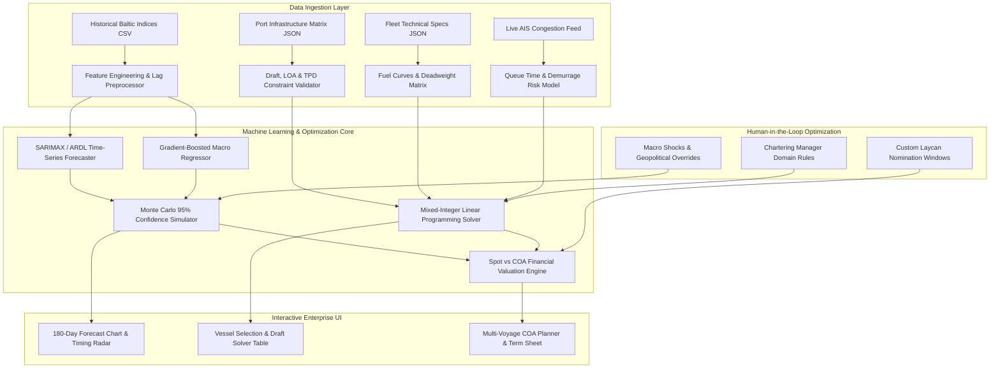
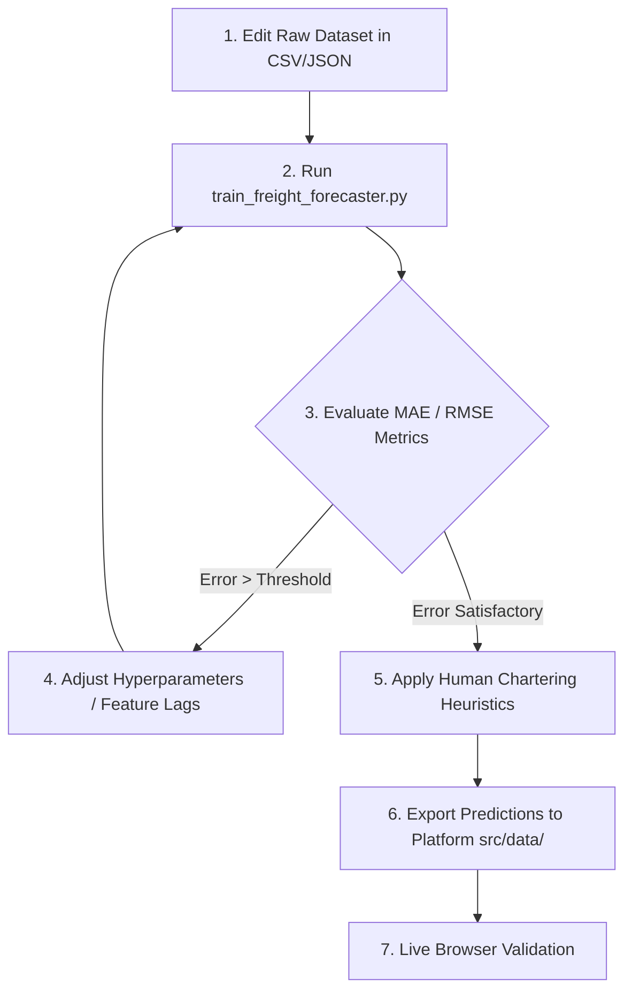

# Vedha Logistics — Machine Learning Models, Datasets & Optimization Guide

This guide documents all **Machine Learning models, mathematical optimization formulations, datasets, and human-in-the-loop (HITL) workflows** powering the Vedha Logistics platform.

---

## 🏗️ End-to-End System Architecture Flowchart



---

## 📊 Inventory of All Datasets Used

All datasets are stored in `ml/datasets/` and `src/data/` for direct inspection and manual modification.

### 1. `ml/datasets/historical_freight_rates.csv`
Contains 10-year monthly econometric and maritime time series data:
- `date`: Month identifier (`YYYY-MM`).
- `bdi`: Baltic Dry Index (Composite dry bulk benchmark).
- `bci`: Baltic Capesize Index (~180,000 DWT vessels).
- `bpi`: Baltic Panamax Index (~75,000 DWT vessels).
- `bsi`: Baltic Supramax Index (~55,000 DWT geared vessels).
- `bhsi`: Baltic Handysize Index (~35,000 DWT vessels).
- `vlsfo_singapore_usd`: Very Low Sulfur Fuel Oil price ($/MT) in Singapore.
- `coking_coal_fob_aus_usd`: Australian Premium Hard Coking Coal FOB ($/MT).
- `thermal_coal_fob_indo_usd`: Indonesian 4200 GAR Thermal Coal FOB ($/MT).
- `iron_ore_cfr_china_usd`: 62% Fe Iron Ore Fines CFR Qingdao ($/MT).
- `paradip_congestion_days`: Average vessel waiting queue days at Paradip.
- `haldia_congestion_days`: Average vessel waiting queue days at Haldia dock.
- `fleet_growth_pct`: Global dry bulk fleet net tonnage annual growth rate (%).
- `dxy_index`: US Dollar Currency Index.
- `monsoon_active_india`: Binary flag (1 = Active SW Monsoon June-Sept, 0 = Dry Season).

### 2. `ml/datasets/port_infrastructure_matrix.json`
Stores physical and operational limitations for Indian East Coast ports & global loading hubs:
- `max_draft_meters`: Absolute maximum permissible draft at low/high tide.
- `max_loa_meters`: Maximum Length Overall allowed at discharge berths.
- `max_beam_meters`: Maximum vessel width for berthing cranes.
- `cargo_handling_tpd`: Average 24-hour discharge/loading throughput (Tons Per Day).
- `is_riverine`: Flag for riverine/estuarine draft bars (e.g. Haldia Hooghly channel).
- `requires_lighterage_capesize`: Whether Capesize vessels must perform Ship-to-Ship (STS) lightering at Sagar-Sandheads.

### 3. `src/data/vesselData.ts` & `ml/scripts/vessel_selection_solver.py`
Fleet technical specifications:
- Deadweight intake (Handysize 35k, Supramax 55k, Ultramax 63.5k, Panamax 75k, Kamsarmax 82k, Capesize 180k MT).
- Speed curves (Laden 13.0–14.2 knots, Ballast 13.5–15.0 knots).
- Fuel consumption models at sea (18.5 to 48.0 MT/day) and in port (3.5 to 5.5 MT/day).
- Daily charter hire baseline benchmarks for Spot, 3-Month COA, and 12-Month COA.

---

## 🤖 Machine Learning & Optimization Models Explained

### Model 1: AutoRegressive Distributed Lag (ARDL) & SARIMAX Forecaster
Captures cyclical seasonality (monsoon lulls, Australian cyclone season, Q4 restocking surges):
$$\Phi_P(B^s)\phi_p(B)(1-B)^d(1-B^s)^D Y_t = \Theta_Q(B^s)\theta_q(B)\epsilon_t + \sum_{k=1}^{K} \beta_k X_{k,t}$$
- **Endogenous Target ($Y_t$)**: Baltic Indices (`bci`, `bpi`, `bsi`, `bdi`).
- **Exogenous Regressors ($X_{k,t}$)**: VLSFO Bunker prices, Coal/Ore spreads, Monsoon indicator, DXY, Port waiting queues.

### Model 2: Monte Carlo Probabilistic Confidence Simulator
Computes forward uncertainty bands widening over forecast horizon $h$:
$$\hat{Y}_{t+h} \pm z_{1 - \alpha/2} \cdot \sigma_{\text{RMSE}} \sqrt{h \cdot \gamma}$$
where $z_{0.975} = 1.96$ for the 95% confidence interval.

### Model 3: Mixed-Integer Linear Programming (MILP) Vessel Selection Solver
Mathematical formulation:
$$\min_{\mathbf{x}} \sum_{v \in \mathcal{V}} x_v \left[ \frac{\text{HireRate}_v \cdot T_v + \text{FuelCost}_v + \text{PortDues}_v}{\min(Q, \text{DWT}_v \cdot 0.95)} + \text{LighterageCost}_v \right]$$
**Subject to:**
- $\sum_{v} x_v = 1, \quad x_v \in \{0, 1\}$ (Select exactly one vessel class)
- $\text{Draft}_v \le \text{PortMaxDraft}_{\text{origin}}$
- $\text{Draft}_v \le \text{PortMaxDraft}_{\text{dest}} + M \cdot \text{CanLighter}_v$
- $\text{LOA}_v \le \text{PortMaxLOA}_{\text{dest}}$

---

## 🔄 Human-in-the-Loop (HITL) Manual Optimization Flowchart

How a Chartering Specialist or Data Scientist can fine-tune performance:



### Manual Tuning Actions You Can Perform:
1. **Update Commodity Prices**: Add new rows to `ml/datasets/historical_freight_rates.csv` with latest market data.
2. **Add Custom Port Constraints**: Modify `ml/datasets/port_infrastructure_matrix.json` when port dredging increases draft limits (e.g. Paradip increasing from 14.5m to 16.0m).
3. **Adjust Bunker Sensitivity Weights**: In `ml/scripts/train_freight_forecaster.py`, adjust the `alpha` L2 regularization parameter or feature lag terms.
4. **Run Training Script**:
   ```bash
   python3 ml/scripts/train_freight_forecaster.py
   python3 ml/scripts/vessel_selection_solver.py
   ```
